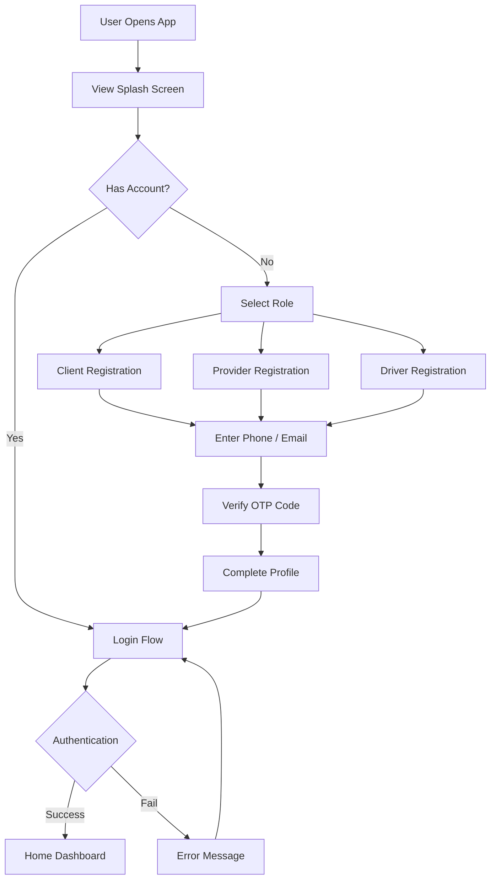
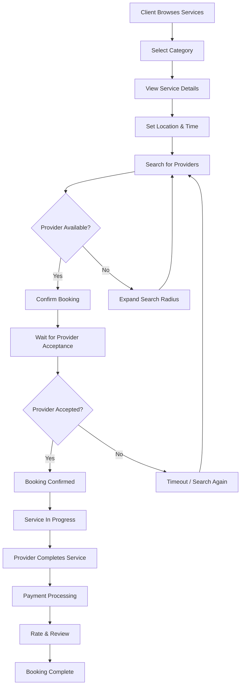
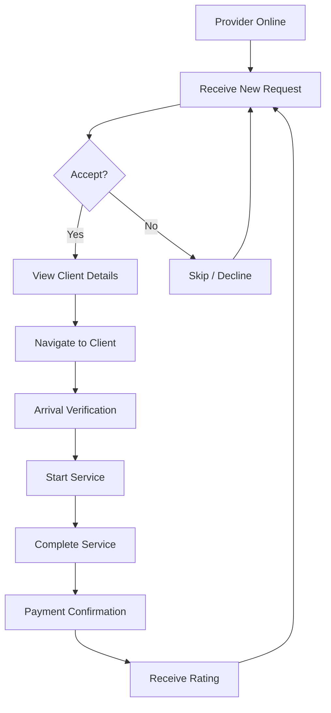
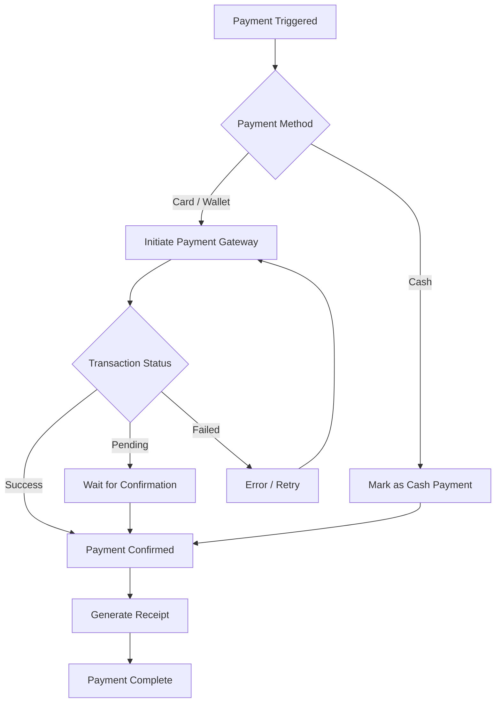
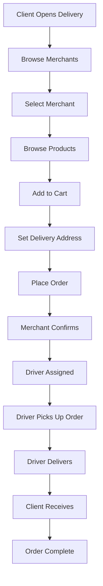
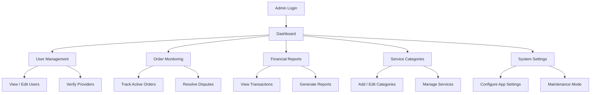
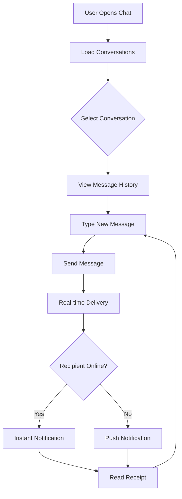
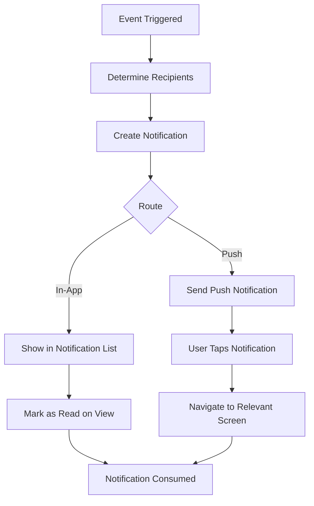

# Faster — Workflow Diagrams (Demo)

**⚠️ GENERIC PROCESS FLOWS — For demonstration and training only.**
**These diagrams show conceptual workflows and do not represent actual implementation.**

---

## 1. User Registration & Onboarding

## 2. Service Booking Flow

## 3. Provider Service Flow

## 4. Payment Processing (Simulated)

## 5. Delivery Order Flow

## 6. Admin Management Dashboard

## 7. Chat & Communication Flow

## 8. Notification System

---

**⚠️ These diagrams represent generic, conceptual workflows.**
**Actual implementation details, business logic, and data flows are proprietary.**

**Faster Demo** © 2024 — Training & Demonstration Purpose Only
